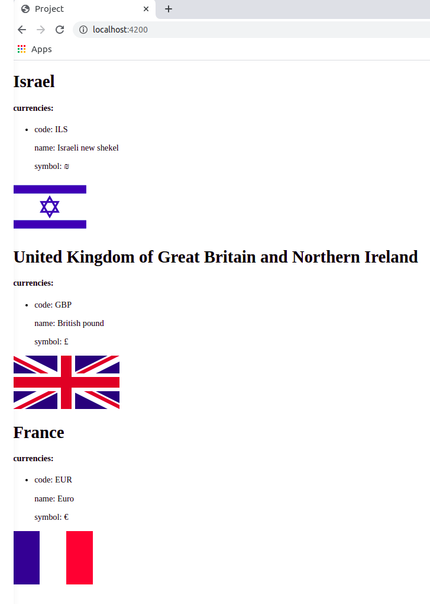

# `@Input()` - Exercise
given the following data:
```json
[
  {
    "currencies": [
      {
        "code": "ILS",
        "name": "Israeli new shekel",
        "symbol": "₪"
      }
    ],
    "flag": "https://restcountries.eu/data/isr.svg",
    "name": "Israel"
  },
  {
    "currencies": [
      {
        "code": "GBP",
        "name": "British pound",
        "symbol": "£"
      }
    ],
    "flag": "https://restcountries.eu/data/gbr.svg",
    "name": "United Kingdom of Great Britain and Northern Ireland"
  },
  {
    "currencies": [
      {
        "code": "EUR",
        "name": "Euro",
        "symbol": "€"
      }
    ],
    "flag": "https://restcountries.eu/data/fra.svg",
    "name": "France"
  }
]
```
* Craete a new angular project
* Add a new componenet named `CountryComponent` that shows the data of a single country
* In the `AppComponent` (root component) store the data of the three countries, and create 3 `CountryComponent` instances (each instance will get the info of a single country and show it to the user)
   
      
         

#### Result mockup
---

